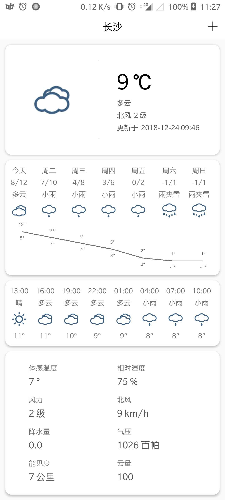
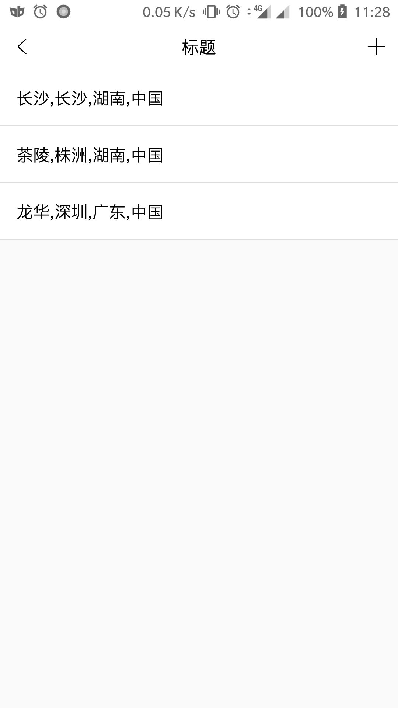

# Weatherkotlin
根据[和风天气](https://www.heweather.com/)提供的[接口](https://www.heweather.com/documents/api/)做的一个天气客户端

## 功能
* 获取当前地区实时天气  
* 获取最近7天的天气预报
* 折线显示近7天的天气预报温度变化
* 获取8个时段的实时天气预报
* 获取当天的生活指数：洗车指数、穿衣指数等
* 手动添加城市，因为不想做定位的权限，所以只提供手动添加城市的功能
* 拖动排序城市列表。左滑或右滑删除城市
* 数据库用的[ObjectBox](https://docs.objectbox.io/)

## 截图

   &nbsp;&nbsp;
   &nbsp;&nbsp;

## 下载

[apk下载地址](app/release/app-release.apk)

## 反馈
* 项目[提交Bug和建议](https://github.com/zhoujia456888/WeatherKotlin/issues)

## 感谢
* [objectbox](https://docs.objectbox.io/)  
* [AndroidUtilCode](https://github.com/Blankj/AndroidUtilCode)
* [gson](https://github.com/google/gson)
* [material-dialogs](https://github.com/afollestad/material-dialogs)
* [BaseRecyclerViewAdapterHelper](https://github.com/CymChad/BaseRecyclerViewAdapterHelper)
* [BRVAH_kotlin](https://github.com/AllenCoder/BRVAH_kotlin)
* [Glide](https://github.com/bumptech/glide)
* [RxKotlin](https://github.com/ReactiveX/RxKotlin)
* [Retrofit](http://square.github.io/retrofit/)
* [EventBus](https://github.com/greenrobot/EventBus)
* [Dagger2](https://github.com/google/dagger)
* [RxLifecycle](https://github.com/trello/RxLifecycle)
* [折线图](https://github.com/auv1107/CurveView)
* [SwipeRecyclerView](https://github.com/yanzhenjie/SwipeRecyclerView)

